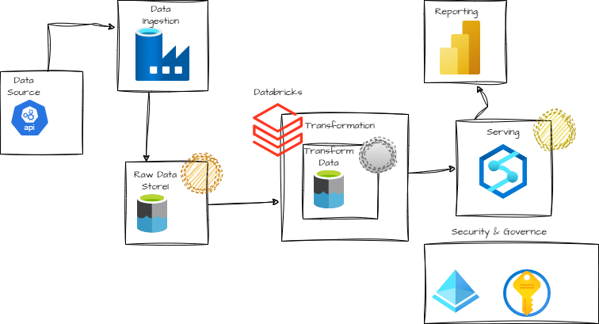

# API-Driven-Data-Integration-and-Analytics-with-Azure

## The tools that are covered in this project are

Azure Data Factory

Azure Data Lake Storage Gen2

Azure Databricks

Azure Synapse Analytics

Azure Key vault

Microsoft Entra ID (Previously called as AAD) and

Microsoft Power BI

## Architecture

)

